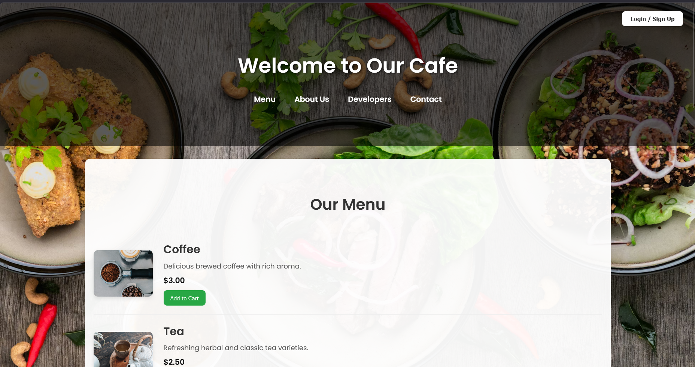
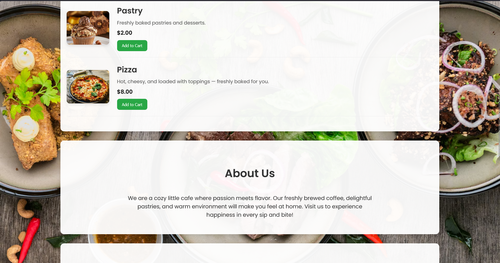
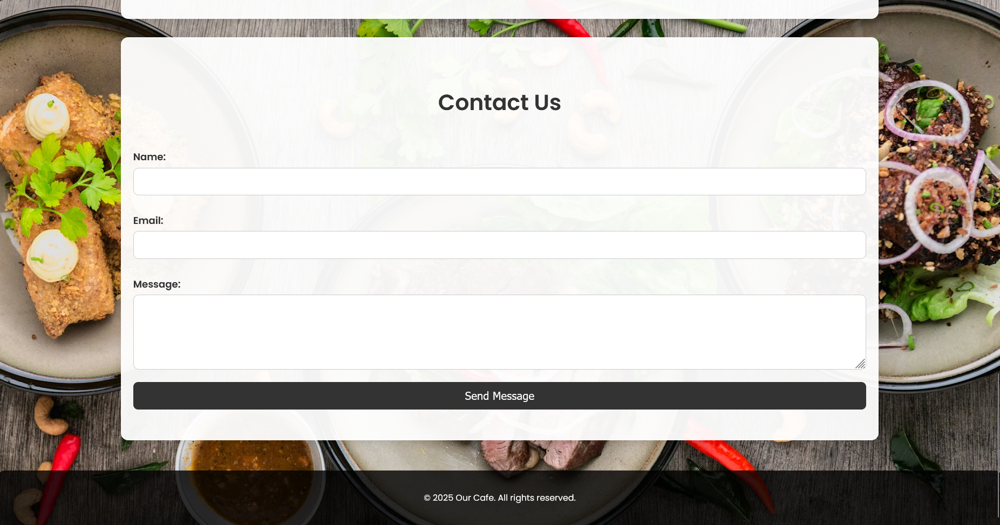

# ☕ Cafe Website

A simple, elegant, and responsive cafe website built with **HTML, CSS, and JavaScript**.  
It showcases the cafe’s menu, about section, developer information, and a contact form with interactive features.

---

## 🚀 Features

- **Hero Section**: Stylish header with background image, navigation, and login modal.
- **Login / Sign Up Modal**: Popup form for user authentication.
- **Menu Section**: Display of food and drinks with images, descriptions, prices, and "Add to Cart" functionality.
- **About Us Section**: Brief introduction about the cafe.
- **Developers Section**: Showcasing developer profiles with images and details.
- **Contact Form**: Functional form with validation and success alert.
- **Responsive Design**: Works across devices with clean layout and modern fonts.
- **Interactive Buttons**: Alerts for cart additions and contact form submissions.

---

## 📂 Project Structure

cafe-website/
│── index.html        # Main HTML file
│── assets/           # Images and background
│   ├── backround.jpg
│   ├── coffee.jpg
│   ├── tea.jpg
│   ├── pastry.jpg
│   └── pizza.jpg

---

## 🛠️ Technologies Used

- **HTML5** – Structure and semantic elements
- **CSS3** – Styling, layout, and responsiveness
- **JavaScript (Vanilla)** – Interactivity (modals, alerts, cart functionality)
- **Google Fonts (Poppins)** – Modern typography

---

## ⚙️ How to Run

1. Clone or download the repository.
2. Place all files in a project folder.
3. Ensure images are inside the `assets/` directory.
4. Open `index.html` in any modern browser.

---

## 🖥️ Screenshots

### Screen 01

### Screen 02

### Screen 03

---

## 👨‍💻 Developer

- **Ayush**  
  *The Mind Behind the Mission*  
  Roll: ******35  

---

## 📜 License

This project is open-source and free to use for learning or personal projects.

---

## ✅ Future Improvements

- Add a shopping cart page with checkout functionality.
- Connect login/signup to a backend (Node.js, Firebase, etc.).
- Store contact form submissions in a database.
- Enhance responsiveness with media queries.
